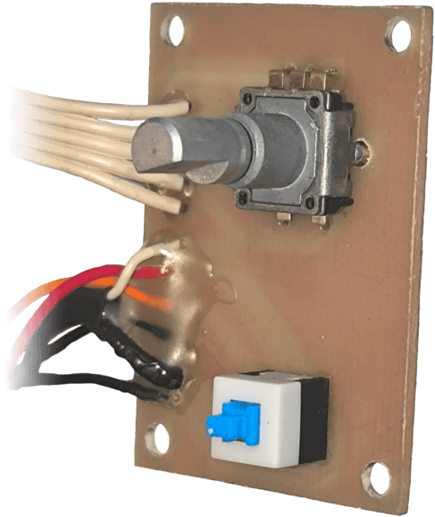
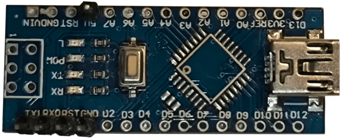

## Electronics
### Architecture Overview

/// caption
Electronics block diagram
///

The system is built around a electronic design, centered on an ATmega328P microcontroller. It uses a DAC to control current draw, and an ADC to monitor voltage and current. The power stage is built using power MOSFETs and shunt resistors.

### PCBs:
- **Main board**: responsible for main funcionalities of the load

{: style="width:90%"}

- **Front board**: responsible for user input with the rotary encoder and switching the voltage measurement circuitry between the main and sense terminals

{ width="40%" style="display: block; margin: auto;" }

- **Converter board**: responsible for user input with the rotary encoder and switching the voltage measurement circuitry between the main and sense terminals 

=== "Angle view"

    { width="60%" style="display: block; margin: auto;" }

=== "Top view"

    { width="63%" style="display: block; margin: auto;" }

=== "Bottom view"

    { width="60%" style="display: block; margin: auto;" }

### Inputs and Interfaces

- **Power input**: Up to 50 V DC, 8 A
- **Remote voltage sensing**: Compensates cable losses
- **Trigger input**: 0–5 V for switching load states in step response mode
- **Power input (AC)**: 230 V AC, powering the internal transformer

### User Interface

- Rotary encoder with push-button
- Numeric keypad
- LCD display for measurements and settings
- Mode and source selection switches

## Mechanical

### Cooling

A temperature-controlled fan manages heat dissipation, automatically adjusting speed based on heatsink temperature. Over-temperature protection shuts off the load above 50°C.

### Enclosure

- Custom-made metal case (CNC cut and bent steel)
- 3D-printed front panel for easy mounting of connectors and display
