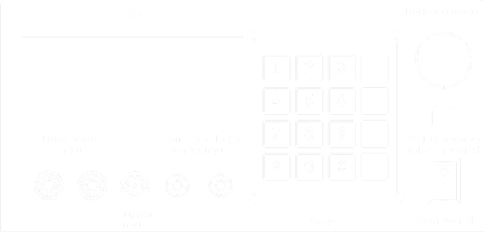
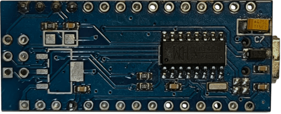

## 🔩 Mechanical

### Panel Layouts
The diagrams below show the layout of all external controls and connectors:

{#fig:front-panel-wireframe width="80%" style="display: block; margin: auto;"}
/// caption
Annotated Front Panel Wireframe
///

{#fig:back-panel-wireframe width="80%" style="display: block; margin: auto;"}
/// caption
Annotated Back Panel Wireframe
///

### Enclosure and Cooling
The enclosure is a hybrid construction designed for durability and ease of assembly. The main chassis is formed from 1mm thick sheet steel, which was CNC laser-cut and then bent into shape. This provides a sturdy frame for all internal components.

The front panel is a custom 3D-printed part, allowing for precise mounting of the display, keypad, switches, and connectors.

Heat from the power MOSFETs is dissipated by a large, tunnel-style aluminum heatsink, which is actively cooled by a temperature-controlled fan. The complete internal assembly can be seen in the image below.

{#fig:load-insides width="80%" style="display: block; margin: auto;"}
/// caption
Internal view of the electronic load
///

## ⚡ Electronics

### Input Specifications

-   __Load power input [*(Front panel)*](#fig:front-panel-wireframe)__

    ---
    - **Max voltage:** 50V DC
    - **Max current:** 8A
    - **Max dissipated power:** 300W (10 min)¹ / 200W (cont.)²

-   __Remote voltage sense input [*(Front panel)*](#fig:front-panel-wireframe)__

    ---
    - **Max voltage:** 50V DC

-   __Mains power input [*(Back panel)*](#fig:back-panel-wireframe)__

    ---
    - **Voltage:** 230V AC
    - **Max power consumption:** 10W

-   __Trigger input [*(Front panell)*](#fig:front-panel-wireframe)__

    ---
    - **Max voltage:** 5V DC

¹ *Assumes ambient temperature of 25°C.*  
² *Assumes an initial heatsink temperature of 25°C.*

### Architecture Overview

{#fig:block-diagram}
/// caption
Electronics block diagram
///

The system's architecture is orchestrated by an `ATmega328P` microcontroller. It interfaces with several key components via I2C, including a 12-bit `MCP4725` DAC to set the load current, a 16-bit `ADS1115` ADC to measure voltage and current, and an `MCP79410` RTC for time-critical operations like battery capacity testing.

The core of the load is the Constant Current Sink, controlled by the DAC and built around `AD8630` operational amplifier and `IRFP250` power MOSFETs. The ADC measures the current flowing through this sink and the voltage at the input terminals. A switch, controlled from the front panel, allows the voltage measurement to be taken either from the main power terminals or from the remote sense terminals via a differential amplifier built on an `OPA277` op-amp. User interaction is managed through a rotary encoder, keypad, and a 4x20 LCD display, while PC communication is handled by a dedicated USB-to-UART converter board.

A transformer provides AC power, which is converted by the internal power supply section into three DC rails: **+12V** (for the cooling fan), **+5V** (for logic and analog circuits), and **-5V** (for the symmetrical supply of the differential amplifier).

### PCBs
The system's electronics are distributed across three distinct PCBs. The functional blocks residing on each board are color-coded for clarity in the [*Electronics block diagram*](#fig:block-diagram) shown above.

- **Main board**: This two-layer PCB performs all core control, measurement, and power handling functions of the electronic load.

{#fig:main-board width="80%" style="display: block; margin: auto;" }

- **Front board**: This single-layer PCB functions as the user interface board, handling manual controls and routing for the voltage measurement signals.

{ width="40%" style="display: block; margin: auto;" }

- **Converter board**: Acts as a dedicated communication bridge for PC control, data acquisition and allows for programming of the main microcontroller. This was implemented cost-effectively by using a modified Arduino Nano board with its original microcontroller desoldered, leaving only the `CH340` USB-to-serial IC functional.

=== "Angle view"

    { width="60%" style="display: block; margin: auto;" }

=== "Top view"

    { width="63%" style="display: block; margin: auto;" }

=== "Bottom view"

    { width="60%" style="display: block; margin: auto;" }
