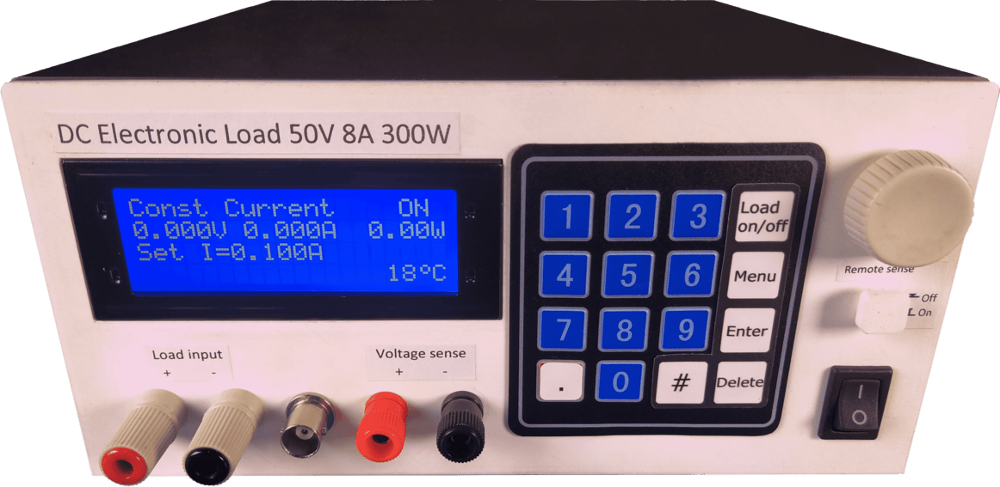

# Electronic DC Load

This project is an open-source programmable electronic load for DC sources such as power supplies and batteries. It simulates various load conditions, enabling performance and durability testing. 

Designed with affordability and practicality in mind, the device offers features typically found in more expensive commercial solutions. It includes protections against overcurrent and over-discharge, a user-friendly interface, and software control capabilities.

## Key Features

- Maximum current: 8 A
- Maximum voltage: 50 V
- Power dissipation: up to 200 W (continuous) / 300 W (short term)
- Multiple operating modes: constant current, power, resistance, step response, and battery test
- Built-in protections: thermal, current, and voltage cutoffs
- PC application for real-time monitoring and control
- Easy to build with open-source schematics and firmware

