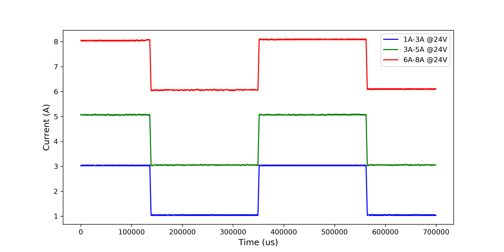

## Calibration & Accuracy

The precision of the electronic load's current and voltage measurements, as well as its set current accuracy, were tested against the `Sanwa PC7000` multimeter. The following tables present the results of these measurements.

### Accuracy of set and measured current values

| Set Value [A] | Load Measurement [A] | Multimeter Measurement [A]  |
|:--------------|:---------------------|:----------------------------|
| 0.1           | 0.104                | 0.1032 ± 0.0029             |
| 0.2           | 0.203                | 0.2024 ± 0.0037             |
| 0.3           | 0.300                | 0.3000 ± 0.0044             |
| 0.4           | 0.406                | 0.4051 ± 0.0053             |
| 0.5           | 0.500                | 0.4997 ± 0.0060             |
| 0.6           | 0.602                | 0.6020 ± 0.0069             |
| 0.7           | 0.702                | 0.7020 ± 0.0077             |
| 0.8           | 0.800                | 0.8000 ± 0.0084             |
| 0.9           | 0.904                | 0.9038 ± 0.0093             |
| 1.0           | 1.007                | 1.0065 ± 0.0101             |
| 2.0           | 2.007                | 2.0070 ± 0.0181             |
| 3.0           | 3.006                | 3.0057 ± 0.0261             |
| 4.0           | 4.003                | 4.0022 ± 0.0341             |
| 5.0           | 5.002                | 5.0007 ± 0.0421             |
| 6.0           | 6.001                | 5.996 ± 0.068               |
| 7.0           | 6.998                | 6.997 ± 0.076               |
| 8.0           | 7.998                | 7.990 ± 0.084               |

### Accuracy of voltage measurements

| Load Measurement [V] | Multimeter Measurement [V] |
|:---------------------|:---------------------------|
| 1.002                | 1.0022 ± 0.0006            |
| 2.002                | 2.0029 ± 0.0009            |
| 3.004                | 3.0043 ± 0.0012            |
| 4.004                | 4.0039 ± 0.0015            |
| 5.006                | 5.0058 ± 0.0018            |
| 8.004                | 8.004 ± 0.006              |
| 10.01                | 10.007 ± 0.007             |
| 12.01                | 12.008 ± 0.007             |
| 14.01                | 14.010 ± 0.008             |
| 16.01                | 16.004 ± 0.009             |
| 18.01                | 18.007 ± 0.010             |
| 20.01                | 20.008 ± 0.011             |
| 25.01                | 25.011 ± 0.013             |
| 30.02                | 30.016 ± 0.015             |
| 35.02                | 35.019 ± 0.017             |
| 40.02                | 40.019 ± 0.019             |
| 45.02                | 45.023 ± 0.021             |
| 50.01                | 50.012 ± 0.023             |

**Conclusion** ✅

The current values measured by the electronic load did not deviate from the set value by more than **7 mA**. All measurements taken by the electronic load are within the range of values measured by the multimeter, considering the multimeter's measurement error.

## Thermal Performance

At full load (300 W for short periods), the device maintained safe thermal conditions due to a heatsink and active fan cooling. Continuous operation at 200 W is sustainable.

## Step Response

Step changes in load (1–3 A, 3–5 A, 6–8 A) showed fast transitions with no overshoot or oscillation. This confirms stable control loop performance.

=== "Transients 24V"
    
    

=== "Transients 5V"

    

## Battery Testing

The battery test mode successfully measured capacity by monitoring discharge current and cutoff voltage. Data was logged and visualized in the PC application.

## Tools Used for Testing

- Sanwa PC7000 Multimeter
- Rigol MSO2102A Oscilloscope
- AXIOMET AX-3005PQ Power Supplies
